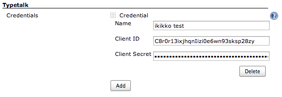
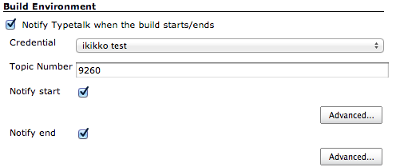

# Typetalk Plugin

## Introduction

This is a Jenkins plugin which works with [Typetalk](https://typetalk.com/). Typetalk is a chat tool provided by [Nulab](https://nulab.com).

## Feature

### Send notification to Typetalk

You can send notification to Typetalk when the following build events occur

- when build starts / ends
- when build fails


### Operate Jenkins from Typetalk

You can operate Jenkins by mentioning to a bot in Typetalk and this enables you to do ChatOps. If you can understand Japanese, Refer to [this blog entry](http://nulab-inc.com/ja/blog/typetalk/chatops-without-programming) for more details.

This plugin provides some features, like build/list projects.

#### Build project


#### List projects


#### Show help messages


## Configuration

### Global configuration

At first, you must add credential to access Typetalk in the global configuration page.

How to configure credentials:

1. [Register a new application](https://typetalk.in/my/develop/applications/register) via the Typetalk Developer Application Page. Choose 'Client Credentials' in 'Grant Type'. Other items are optional.
2. Input the 'Client ID' and 'Client Secret' displayed on the registration page. Input any value in 'Name'.



### Job configuration

#### Build Environment

In this section, you can configure notifications about starting/ending build.
You can also change notification message as you like.



#### Post-build Actions

In this section, you can configure notifications about build results.
The notifications are sent when the build doesn't succeed and recovers.


#### Pipeline step

You can use typetalk step in your pipeline as well as a classic style job.
When you want to notify a build result, you can use 'typetalkSend' step with 'catchError'.

```
node {
    catchError {
        sh 'might fail'
    }
    typetalkSend name: 'ikikko test', topicId: 9260
}
```

You can also notify an event which starts and/or ends with 'withTypetalk' step.

```
withTypetalk(name: 'ikikko test', notifyEnd: true, notifyEndMessage: '', notifyStart: true, notifyStartMessage: '', topicId: 9260) {
    // some block
}
```

#### Notification URL

In order to operate Jenkins from Typetalk, you should set a certain endpoint to Typetalk bot in a topic.

### Bot for all Jenkins projects

This plugin provides the following endpoint to receive message from Typetalk. You have to set it to a webhook URL of Typetalk bot. See the official document for more.

`http://<Jenkins URL>/typetalk/notify`

Then, you can operate Jenkins by mentioning to the bot as follows:

- `@jenkins+ build <project> (<key=value>)`
- `@jenkins+ list (<regexp filter>)`
- `@jenkins+ help (<sub command>)`

In this case, @jenkins+ is your bot name here.

### Bot for a single Jenkins project

By adding project name as a parameter of webhook URL,

`http://<Jenkins URL>/typetalk/notify?project=<project>`

then you can omit the name when mentioning to Typetalk bot like this.

- `@jenkins-project+`
- `@jenkins-project+ build (<key=value>)`
